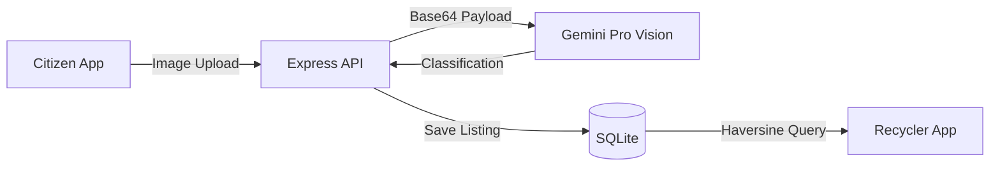

<div align="center">
  
  <h1>IWIS (Intelligent Waste Information System)</h1>
  <p><em>AI-Powered. Geospatial. Gamified. The Digital Infrastructure for the Circular Economy.</em></p>

  [](https://opensource.org/licenses/MIT)
  [](#)
  [](#)
  [](#)
  [](#)
  [](docs/CONTRIBUTING.md)
</div>

---

## 📖 Table of Contents
- [Problem Statement](#-problem-statement)
- [The Solution](#-the-solution)
- [Key Features](#-key-features)
- [Architecture](#-architecture)
- [Technology Stack](#-technology-stack)
- [Screenshots](#-screenshots)
- [Installation Guide](#-installation-guide)
- [Environment Variables](#-environment-variables)
- [Documentation](#-documentation)
- [Roadmap & Security](#-roadmap--security)
- [Contributing](#-contributing)
- [License](#-license)

---

## 🌍 Problem Statement
Urban waste management is fragmented. Citizens lack the incentive and knowledge to recycle bulk materials properly, and local recyclers (Kabadiwalas) operate on inefficient, manual routing systems with no visibility into where waste actually is. This results in millions of tons of recyclable material ending up in landfills.

## 💡 The Solution
IWIS bridges the gap by providing an **AI-powered marketplace**. 
1. A citizen snaps a photo of their waste. 
2. The AI identifies it, calculates its value, and creates a listing.
3. Nearby recyclers see the listing on a geospatial feed and drive directly to collect it.

## ✨ Key Features
* 🤖 **AI Scanner:** Gemini Vision integration for zero-friction material classification.
* 📍 **Geospatial Feed:** Haversine distance-based routing for recyclers to find waste.
* 🏆 **Gamification Engine:** Citizens earn "Green Points" and level up ecologically.
* 💸 **Dynamic Pricing:** Localized scrap value calculator engine.
* 🔒 **Role-Based Access:** Isolated Citizen and Recycler dashboard experiences.

---

## 🏗️ Architecture



## 🛠️ Technology Stack

| Layer | Technology | Description |
| --- | --- | --- |
| **Frontend** | Next.js (React) | SPA built with responsive Vanilla CSS and interactive charts (Recharts). |
| **Backend** | Express (Node.js) | REST API using Zod for robust request validation. |
| **Database** | SQLite | Serverless SQL database (Targeted for PostgreSQL migration in v2). |
| **AI Vision** | Gemini API | Multi-modal large language model for material recognition. |
| **Auth** | JWT & Bcrypt | Stateless authentication with Role-Based Access Control. |

---

## 📸 Screenshots
*(Sample images from the v1.0 Pilot Release)*

| Citizen Dashboard | AI Scanner | Recycler Geospatial Feed |
| :---: | :---: | :---: |
|  |  |  |

---

## 🚀 Installation Guide

### Prerequisites
- Node.js `v20+`
- Git

### 1. Clone the Repository
```bash
git clone https://github.com/your-username/iwis.git
cd iwis
```

### 2. Setup the Backend
```bash
cd backend
npm install
cp .env.example .env
# Edit .env with your Gemini API Key and JWT Secret
npm run build
npm start
```
The API will start on `http://localhost:5000`.

### 3. Setup the Frontend
Open a new terminal window:
```bash
cd frontend
npm install
cp .env.example .env.local
npm run build
npm start
```
The application will start on `http://localhost:3000`.

---

## 🔐 Environment Variables

| Variable | Location | Required | Description |
| --- | --- | --- | --- |
| `GEMINI_API_KEY` | `backend/.env` | ✅ | Primary API key for the Vision AI. |
| `JWT_SECRET` | `backend/.env` | ✅ | Cryptographic key for signing sessions. |
| `DB_PATH` | `backend/.env` | ❌ | Defaults to `./iwis.db`. |
| `NEXT_PUBLIC_API_URL`| `frontend/.env.local` | ❌ | Defaults to `http://localhost:5000/api`. |

---

## 📚 Documentation
We maintain comprehensive documentation in the `/docs` directory:
- [System Design & Architecture](docs/SYSTEM_DESIGN.md)
- [API Reference](docs/API_REFERENCE.md)
- [Database Schema](docs/DATABASE_SCHEMA.md)
- [Security Model](docs/SECURITY_MODEL.md)

---

## 🗺️ Roadmap & Security
- Check out our transparent [Known Limitations](docs/KNOWN_LIMITATIONS.md) and future [Roadmap](docs/ROADMAP.md).
- Found a vulnerability? Please review our [Security Policy](docs/SECURITY_MODEL.md) and report it responsibly.

---

## 🤝 Contributing
We welcome contributions from researchers, developers, and municipalities! Please read our [Contributing Guidelines](docs/CONTRIBUTING.md) and [Code of Conduct](docs/CODE_OF_CONDUCT.md) before submitting a Pull Request.

---

## 📜 License
This project is licensed under the [MIT License](LICENSE) - see the LICENSE file for details.

<div align="center">
  <i>Built for a sustainable future. 🌍</i>
</div>
