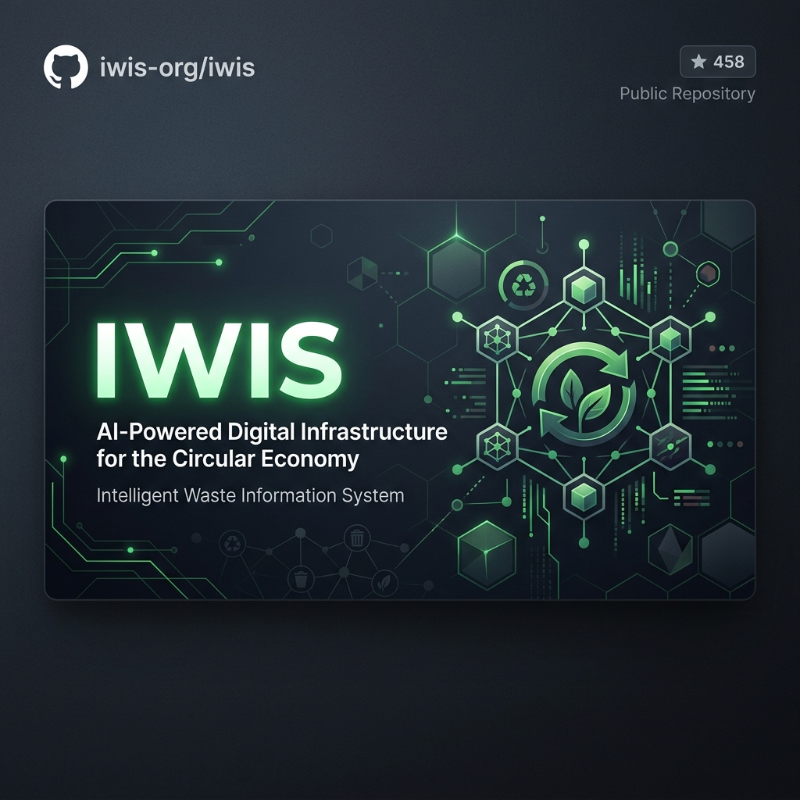
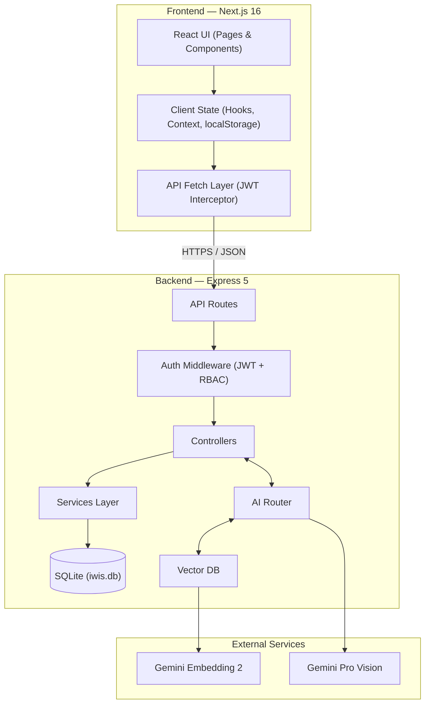
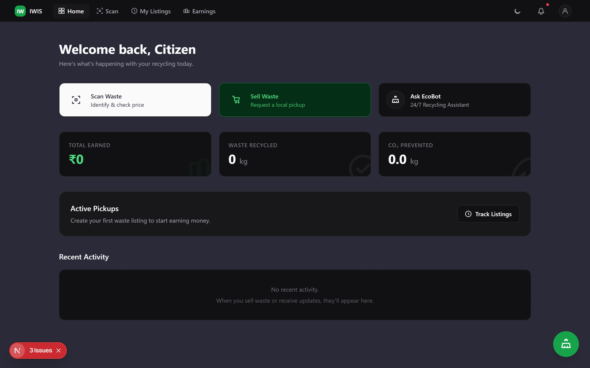
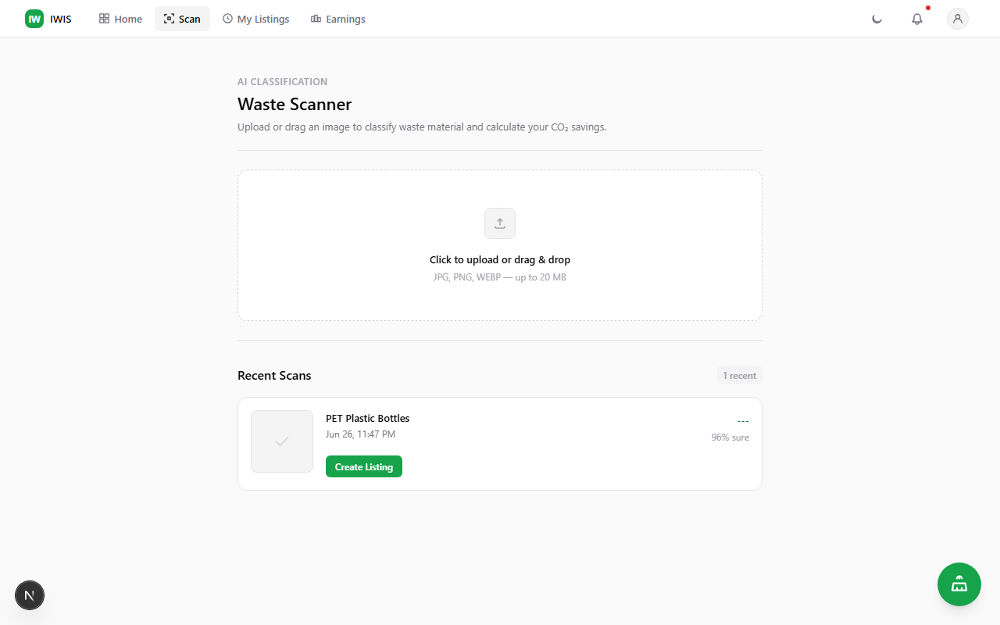
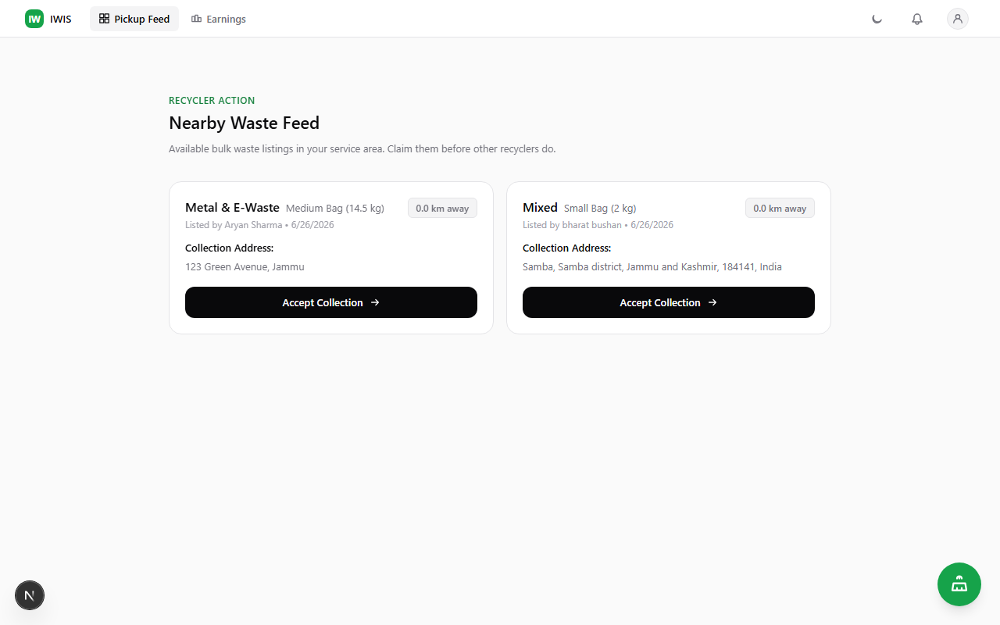
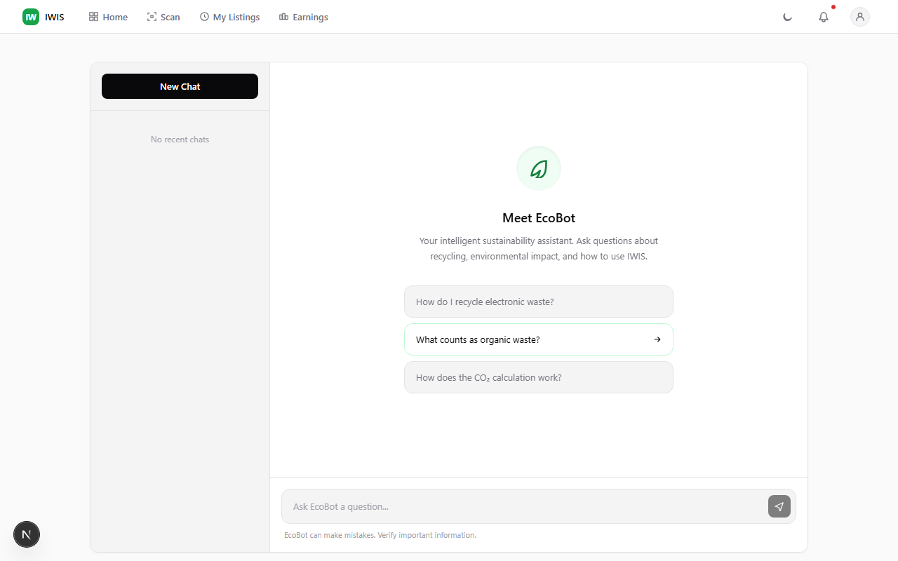

<div align="center">
  

  <br />
  <br />

  

  <h1 align="center">IWIS</h1>
  <p align="center">
    <strong>Waste intelligence for the real world.</strong>
  </p>
  
  <p align="center">
    Track your environmental impact, discover recyclers, and participate in India's leading circular economy network.
  </p>

  <p align="center">
    <a href="https://github.com/1Bharat007/IWIS-GREEN-v1.2/blob/main/LICENSE">
      
    </a>
    <a href="https://github.com/1Bharat007/IWIS-GREEN-v1.2/actions">
      
    </a>
    <a href="https://nodejs.org">
      
    </a>
    <a href="https://nextjs.org/">
      
    </a>
  </p>
</div>

---

## See it in Action

<div align="center">
  
</div>

## Why IWIS Exists

### The Problem
Traditional waste management systems in emerging economies operate blindly. Citizens lack the knowledge and incentive to segregate waste, municipalities struggle to optimize collection routes without real-time data, and recyclers face inconsistent supply chains. Valuable recyclable material ends up in landfills, creating severe environmental and public health hazards.

### The Solution
IWIS (Intelligent Waste Information System) bridges the gap between citizens, recyclers, and municipalities through an AI-powered platform. By turning a smartphone camera into a sophisticated waste classification tool, IWIS removes the friction from recycling. We empower citizens to instantly identify, segregate, and monetize their waste while providing municipalities with the macro-level intelligence needed to transition to a true circular economy.

---

## System Architecture

IWIS is designed for extreme scale, utilizing a decoupled architecture that ensures low latency and high availability.

<div align="center">
  


</div>

> Note: View the full [System Design Documentation](./docs/Architecture.md) for deeper technical insights.

---

## Feature Highlights

- 🧠 **AI Waste Classification:** Identify waste material type, recyclability, and carbon impact using real-time computer vision (Powered by Google Gemini).
- 🔄 **Direct Recycler Marketplace:** Connect citizens directly with local, verified scrap dealers for bulk waste pickups.
- 💰 **Transparent Pricing Engine:** Access localized, real-time scrap market prices to ensure fair compensation.
- 🤖 **EcoBot Sustainability Assistant:** Get instant answers to complex recycling questions and local regulations.
- 📊 **Impact Tracking:** Visualize personal and community-level carbon emission reductions in real-time.

---

## Screenshot Gallery

<div align="center">
  <table>
    <tr>
      <td align="center"><br /><b>Citizen Dashboard</b></td>
      <td align="center"><br /><b>AI Scanner</b></td>
    </tr>
    <tr>
      <td align="center"><br /><b>Recycler Feed</b></td>
      <td align="center"><br /><b>EcoBot Assistant</b></td>
    </tr>
  </table>
</div>

---

## Technology Stack

IWIS is built on a modern, robust, and scalable open-source stack.

- **Frontend:** Next.js 14, React 18, Tailwind CSS, Recharts
- **Backend:** Node.js, Express, SQLite (WAL Mode), JWT Authentication
- **AI / Machine Learning:** Google Generative AI (Gemini Flash & Embedding models)
- **Infrastructure:** Render (Backend API), Vercel (Frontend Edge Delivery)

---

## Quick Start

Get IWIS running locally in under 3 minutes.

### 1. Clone the repository
```bash
git clone https://github.com/1Bharat007/IWIS-GREEN-v1.2.git
cd IWIS-GREEN-v1.2
```

### 2. Configure Environment
```bash
# Setup backend environment
cp backend/.env.example backend/.env
# Setup frontend environment
cp frontend/.env.example frontend/.env.local
```

### 3. Start the Platform
```bash
# Terminal 1: Start Backend API
cd backend
npm install
npm run dev

# Terminal 2: Start Frontend Application
cd frontend
npm install
npm run dev
```
Visit `http://localhost:3000` to view the application.

### 4. Demo Dataset (Optional)
To instantly populate your local environment with realistic test data:
```bash
cd backend
npx ts-node scripts/seed-demo.ts
```

---

## Documentation

Comprehensive documentation is available in the [`/docs`](./docs/) directory.

- 📚 [API Reference](./docs/API.md)
- 🗄️ [Database Schema](./docs/Database.md)
- 🏗️ [System Design](./docs/Architecture.md)
- 🔒 [Security Model](./docs/Security.md)

---

## Roadmap

Curious about what we're building next? Check out our [Implementation Roadmap](./docs/Roadmap.md) for details on upcoming features, PostgreSQL migrations, and IoT integrations.

---

## Contributing

We believe in the power of open-source to solve global challenges. Whether you're a developer, designer, or sustainability advocate, we welcome your contributions!

Please review our [Contributing Guidelines](./CONTRIBUTING.md) and [Code of Conduct](./CODE_OF_CONDUCT.md) before submitting a Pull Request.

---

## License

This project is licensed under the [MIT License](./LICENSE). 

<p align="center">
  Built with ❤️ for a cleaner planet.
</p>
