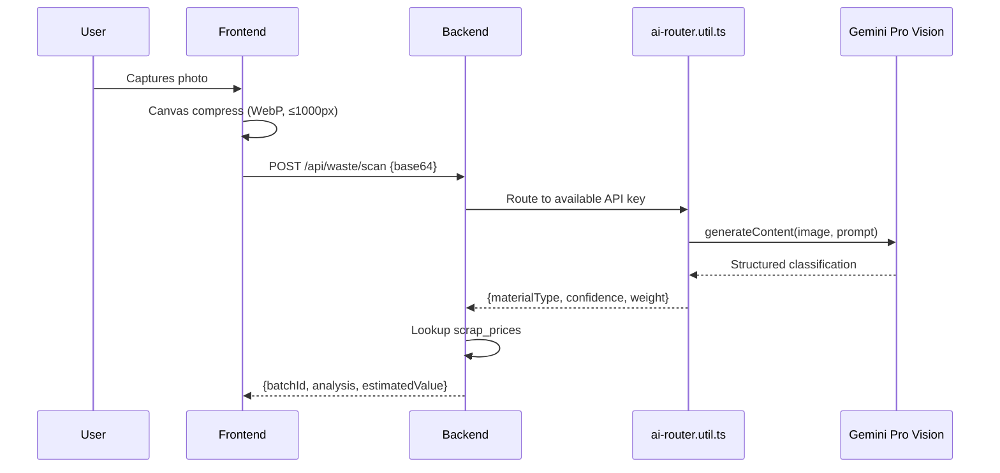
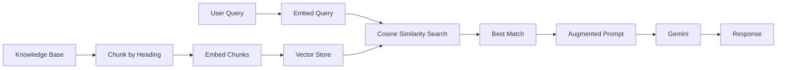

# AI & RAG Documentation

This document covers IWIS's AI subsystem: the Gemini Vision waste scanner, the RAG-enhanced EcoBot, and the vector embedding pipeline.

---

## AI Waste Scanner

### Overview

The AI Scanner is the core citizen experience. Users photograph waste, and Gemini Pro Vision classifies the material in real-time.

### Architecture



### Multi-Key Rotation

The `ai-router.util.ts` implements automatic API key rotation:

1. Attempts `GEMINI_API_KEY` (primary)
2. On failure (quota, rate limit, network), cascades to `GEMINI_API_KEY_2`
3. Falls back to `GEMINI_API_KEY_3`
4. If all keys fail, returns a structured error to the client

This ensures high availability even under Gemini free-tier quota limits.

### Classification Output

The AI is prompted to return structured JSON:

```json
{
  "materialType": "PET Plastic",
  "confidence": 98,
  "estimatedWeightKg": 2.5,
  "isRecyclable": true,
  "description": "Clear PET plastic bottles suitable for recycling"
}
```

### Client-Side Image Compression

Before upload, the frontend compresses images using the Canvas API:

- Maximum dimension: 1000px (maintains aspect ratio)
- Format: WebP preferred, JPEG fallback
- Quality: 50–70%
- Separate thumbnail generation (20–40 KB) for scan history

---

## EcoBot (RAG-Enhanced Chatbot)

### Overview

EcoBot is an AI assistant that answers waste management questions. It uses Retrieval-Augmented Generation (RAG) to provide contextually accurate responses grounded in a curated knowledge base.

### How RAG Works



1. **Knowledge Base:** Markdown files in `backend/knowledge/` containing curated waste management information.
2. **Chunking:** Files are split by `##` headings to maintain semantic coherence.
3. **Embedding:** Each chunk is embedded using `gemini-embedding-2` (3072 dimensions).
4. **Search:** User queries are embedded and compared against stored vectors via cosine similarity.
5. **Threshold:** Matches scoring above 0.85 are injected into the Gemini prompt as context.
6. **Generation:** Gemini generates a response grounded in the retrieved context.

### Feature Flag

RAG is controlled by the `ENABLE_RAG` environment variable:

| Value | Behavior |
|-------|----------|
| `true` | Initialize vector DB, embed knowledge base, enable semantic search |
| `false` (default) | Skip all embedding initialization, EcoBot uses standard Gemini only |

### Graceful Degradation

The RAG system is designed to never crash the server:

- If the knowledge base directory is missing → logs warning, continues
- If embedding fails → logs structured summary, continues
- If all embeddings fail → EcoBot operates without retrieval
- If `ENABLE_RAG=false` → skips initialization entirely

### Startup Log (Healthy)

```
[RAG] Initializing Vector DB...
[RAG] Created 53 chunks. Generating embeddings...

--- Embedding Summary ---
Documents: 10
Chunks: 53
Embedded: 53
Failed: 0
Duration: 12.0s
-------------------------

[RAG] Vector DB Initialization complete.
```

### Startup Log (Disabled)

```
[RAG] ENABLE_RAG is false. RAG Disabled.
```

---

## Embedding Model

| Property | Value |
|----------|-------|
| Model | `gemini-embedding-2` |
| Dimensions | 3072 |
| SDK | `@google/genai` v1.46+ |
| API Version | v1beta (SDK default) |
| Batch Size | 10 chunks per batch |

> **Note:** The older `text-embedding-004` model is not supported in the current SDK version. See [RC-3.1 Root Cause Analysis](../CHANGELOG.md) for details.

---

## Performance Considerations

- Embeddings are generated **once** at server startup and cached in memory.
- Re-embedding does not occur on subsequent requests or server restarts within the same process.
- The `isInitialized` flag prevents duplicate initialization.
- Vector search adds ~50ms latency per EcoBot query.
- Knowledge base changes require a server restart to re-embed.
