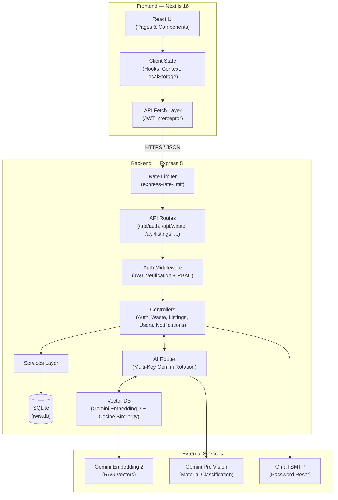
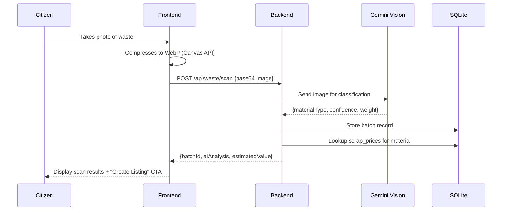

# Architecture

## Overview

IWIS follows a decoupled client-server architecture. The frontend is a Next.js 16 Single Page Application using the App Router, while the backend is an Express 5 REST API backed by SQLite.

## Module Breakdown

### 1. Authentication

IWIS uses stateless **JSON Web Tokens (JWT)**.

- **Registration:** Users sign up as `citizen` or `recycler`. Passwords are hashed with `bcrypt` (cost factor 10).
- **Login:** Returns a signed JWT containing `userId`, `role`, and `email`.
- **Session Management:** The frontend stores the JWT in `localStorage`. The API fetch utility automatically attaches it as a `Bearer` token.
- **Token Expiry:** On HTTP 401, the frontend intercepts the response, clears storage, and redirects to `/login`.
- **RBAC:** The `authMiddleware` injects `req.user` into the request. Controllers validate `req.user.role` before executing mutations.

### 2. AI Waste Scanner

The core citizen experience:

1. **Client-Side Compression:** Images are compressed to WebP (max 1000px, 50–70% quality) via the Canvas API before upload.
2. **Payload:** Sent as a Base64 string to avoid multipart/form-data complexity.
3. **AI Routing:** `ai-router.util.ts` attempts the primary Gemini API key. On failure (quota/downtime), it cascades to backup keys (`GEMINI_API_KEY_2`, `GEMINI_API_KEY_3`).
4. **Classification:** Returns structured JSON: Material Type, Confidence Score, Estimated Weight.
5. **Price Lookup:** The backend joins the classified material against the `scrap_prices` table to return an Estimated Value.

### 3. Recycler Geospatial Feed

- Recyclers view a distance-sorted feed of active listings.
- The backend calculates **Haversine distance** between the recycler's GPS coordinates and each listing's coordinates.
- **Concurrency Control:** A pessimistic lock (`status = 'active'`) prevents double-acceptance. The frontend enforces double-click prevention.

### 4. RAG-Enhanced EcoBot

- **Knowledge Base:** Markdown files in `backend/knowledge/` are chunked by `##` headings.
- **Embeddings:** Each chunk is embedded using `gemini-embedding-2` (3072-dimensional vectors).
- **Search:** User queries are embedded and compared via cosine similarity against the vector store.
- **Feature Flag:** `ENABLE_RAG=true|false` controls whether the vector DB initializes.
- **Graceful Degradation:** If embeddings fail, EcoBot falls back to standard Gemini completions.

### 5. Earnings & Gamification

- **Citizens** accrue INR (₹) and Green Points upon listing completion.
- **Tier System:** Seed → Sprout → Tree, based on cumulative CO₂ saved.
- **Transactions:** Immutable ledger entries link Citizen ↔ Listing ↔ Recycler.

### 6. Notification System

- Server-generated alerts on state changes (listing accepted, pickup scheduled, points earned).
- The frontend polls on page load and displays in a dedicated notifications view.

## Data Flow

## Database Design

See [Database Schema](Database.md) for complete table definitions.

## Security Architecture

See [Security Model](Security.md) for authentication, authorization, and input validation details.
