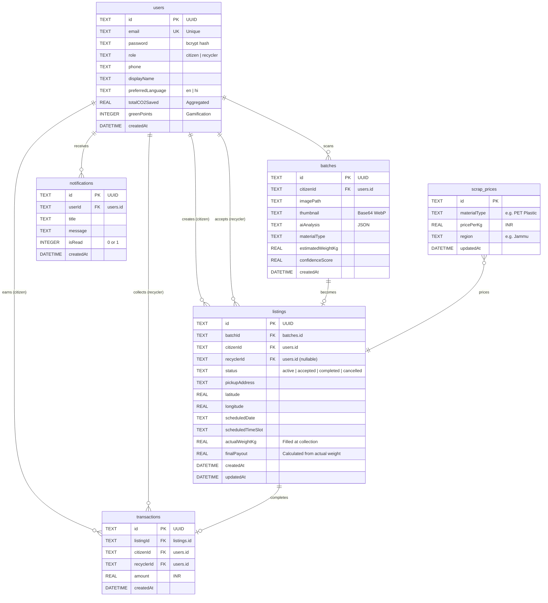

# Database Schema

IWIS v1.0 uses SQLite as an embedded database (`iwis.db`). The schema is designed to be fully portable to PostgreSQL for v2.0.

The database is auto-migrated on server startup via idempotent `CREATE TABLE IF NOT EXISTS` and `ALTER TABLE` statements in `backend/src/db.ts`.

---

## Entity Relationship Diagram

---

## Table Details

### `users`

Stores all platform users. The `role` field determines access to citizen or recycler features.

| Column | Type | Constraints | Description |
|--------|------|-------------|-------------|
| id | TEXT | PRIMARY KEY | UUID v4 |
| email | TEXT | UNIQUE, NOT NULL | Login identifier |
| password | TEXT | NOT NULL | bcrypt hash (cost 10) |
| role | TEXT | NOT NULL | `citizen` or `recycler` |
| phone | TEXT | | Contact number |
| displayName | TEXT | | Public display name |
| preferredLanguage | TEXT | DEFAULT `'en'` | `en` or `hi` |
| totalCO2Saved | REAL | DEFAULT `0` | Cumulative CO₂ impact |
| greenPoints | INTEGER | DEFAULT `0` | Gamification score |
| createdAt | DATETIME | DEFAULT CURRENT_TIMESTAMP | |

### `scrap_prices`

Localized pricing engine. Seeded per region on first boot.

| Column | Type | Description |
|--------|------|-------------|
| id | TEXT | PRIMARY KEY |
| materialType | TEXT | e.g. `PET Plastic`, `Cardboard` |
| pricePerKg | REAL | Current market rate in INR |
| region | TEXT | Geographic region (e.g. `Jammu`) |
| updatedAt | DATETIME | Last price update |

### `batches`

Each row represents one AI scan session.

| Column | Type | Description |
|--------|------|-------------|
| id | TEXT | PRIMARY KEY (UUID) |
| citizenId | TEXT | FK → users.id |
| imagePath | TEXT | Original image reference |
| thumbnail | TEXT | Compressed WebP Base64 (20–40 KB) |
| aiAnalysis | TEXT | Raw JSON from Gemini Vision |
| materialType | TEXT | Parsed material classification |
| estimatedWeightKg | REAL | AI-estimated weight |
| confidenceScore | REAL | Classification confidence (0–100) |
| createdAt | DATETIME | Scan timestamp |

### `listings`

Marketplace items. Lifecycle: `active` → `accepted` → `completed`.

| Column | Type | Description |
|--------|------|-------------|
| id | TEXT | PRIMARY KEY (UUID) |
| batchId | TEXT | FK → batches.id |
| citizenId | TEXT | FK → users.id (creator) |
| recyclerId | TEXT | FK → users.id (assigned on accept, nullable) |
| status | TEXT | `active`, `accepted`, `completed`, `cancelled` |
| pickupAddress | TEXT | Human-readable address |
| latitude | REAL | GPS latitude |
| longitude | REAL | GPS longitude |
| scheduledDate | TEXT | Collection date |
| scheduledTimeSlot | TEXT | `Morning`, `Afternoon`, `Evening` |
| actualWeightKg | REAL | Physical weight (filled by recycler) |
| finalPayout | REAL | Calculated from actual weight × price/kg |
| createdAt | DATETIME | Listing creation |
| updatedAt | DATETIME | Last status change |

### `transactions`

Immutable ledger of completed collections.

| Column | Type | Description |
|--------|------|-------------|
| id | TEXT | PRIMARY KEY (UUID) |
| listingId | TEXT | FK → listings.id |
| citizenId | TEXT | FK → users.id |
| recyclerId | TEXT | FK → users.id |
| amount | REAL | Payout amount in INR |
| createdAt | DATETIME | Transaction timestamp |

### `notifications`

System-generated alerts.

| Column | Type | Description |
|--------|------|-------------|
| id | TEXT | PRIMARY KEY (UUID) |
| userId | TEXT | FK → users.id |
| title | TEXT | Notification title |
| message | TEXT | Notification body |
| isRead | INTEGER | `0` (unread) or `1` (read) |
| createdAt | DATETIME | Generation timestamp |

---

## Indexes

| Index | Table | Columns | Purpose |
|-------|-------|---------|---------|
| `idx_listings_status_location` | listings | status, latitude, longitude | Accelerate recycler feed distance queries |
| `idx_batches_citizenId` | batches | citizenId | Speed up citizen scan history lookups |

---

## Migration Strategy

The current SQLite schema is designed for direct portability to PostgreSQL:

- All primary keys are TEXT (UUID), avoiding auto-increment conflicts.
- No SQLite-specific functions are used in queries.
- Date columns use ISO 8601 strings, compatible with PostgreSQL `TIMESTAMP`.
- The v2.0 migration will replace `sqlite3` with `pg` and add PostGIS for advanced geospatial queries.
