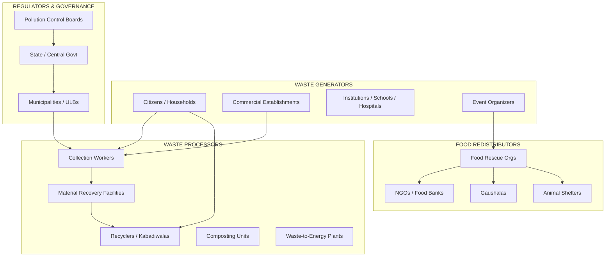
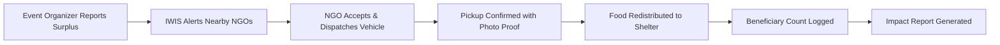
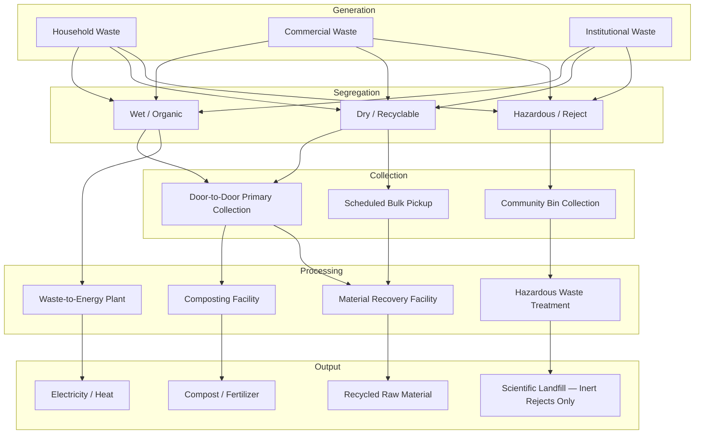
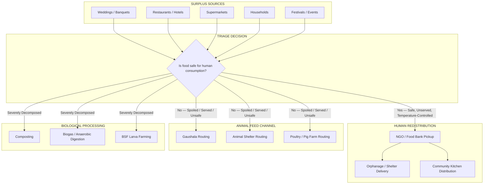
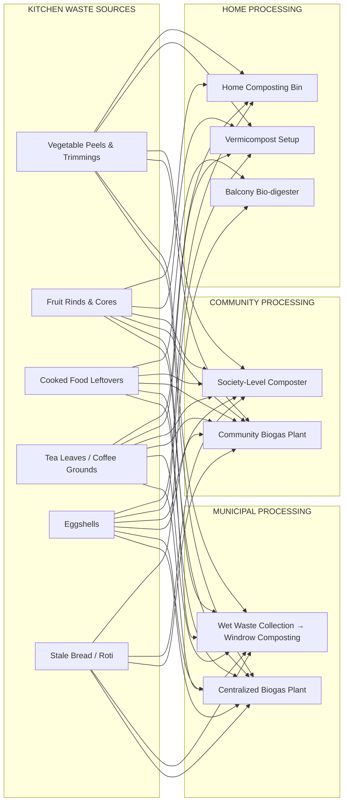
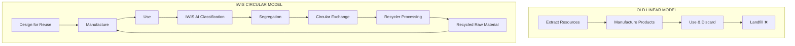

# IWIS — India Waste Intelligence System
## National Platform Architecture & Product Requirements Document

**Version:** 1.0  
**Classification:** Strategy Document  
**Prepared for:** IWIS Core Team  
**Date:** June 2026

---

# Table of Contents

1. [Executive Summary](#1-executive-summary)
2. [Stakeholder Map](#2-stakeholder-map)
3. [Portal Architecture](#3-portal-architecture)
4. [User Journeys](#4-user-journeys)
5. [Waste Lifecycle](#5-waste-lifecycle)
6. [Food Waste Lifecycle](#6-food-waste-lifecycle)
7. [Kitchen Waste Management Lifecycle](#7-kitchen-waste-management-lifecycle)
8. [Recycler Ecosystem](#8-recycler-ecosystem)
9. [Incentive Ecosystem](#9-incentive-ecosystem)
10. [Revenue Model](#10-revenue-model)
11. [Waste Intelligence Layer](#11-waste-intelligence-layer)
12. [Digital Twin Integration](#12-digital-twin-integration)
13. [Carbon Accounting System](#13-carbon-accounting-system)
14. [Waste Marketplace (Circular Exchange)](#14-waste-marketplace-circular-exchange)
15. [Circular Economy Model](#15-circular-economy-model)
16. [Phased Roadmap](#16-phased-roadmap)
17. [Features to Remove](#17-features-to-remove)
18. [Maximum Impact Features](#18-maximum-impact-features)

---

# 1. Executive Summary

IWIS is a national-scale, AI-powered waste intelligence platform designed to digitize, optimize, and transform India's entire waste management value chain. It connects **citizens, municipalities, recyclers, collection workers, NGOs, food rescue organizations, gaushalas, animal shelters, and government agencies** into a single interoperable ecosystem.

**The core thesis:** India's waste crisis is not a waste problem — it is an **information problem**. Waste has value. The system fails because generators, processors, and regulators operate in disconnected silos with no shared data layer. IWIS is the shared data layer.

**Scale target:** 500+ Urban Local Bodies (ULBs), 100M+ citizens, 50,000+ recyclers, 10,000+ NGOs.

---

# 2. Stakeholder Map



### Stakeholder Profiles

| Stakeholder | Primary Need | Value from IWIS |
| :--- | :--- | :--- |
| **Citizens** | Easy segregation, civic participation | AI Scanner, Green Points, pickup scheduling |
| **Municipalities** | Operational efficiency, compliance reporting | Real-time dashboards, route optimization, SBM compliance |
| **Recyclers** | Consistent supply of clean, sorted material | Marketplace access, demand forecasting, fair pricing |
| **Collection Workers** | Route clarity, task management, dignified work | Mobile task app, digital attendance, performance bonuses |
| **NGOs** | Surplus food discovery, logistics coordination | Real-time surplus alerts, cold-chain tracking |
| **Food Rescue Orgs** | Regulatory compliance, rapid redistribution | FSSAI-compliant workflows, pickup scheduling |
| **Gaushalas** | Consistent safe vegetable waste supply | Verified feed listings, contamination alerts |
| **Animal Shelters** | Safe organic waste for feeding programs | Curated feed matching, quality verification |
| **Government Agencies** | Policy data, national benchmarks, SBM targets | Aggregated analytics, district comparison, EPR tracking |

---

# 3. Portal Architecture

IWIS operates as a **single platform with role-based portals**, not separate applications. Authentication determines the portal. This reduces engineering cost while maintaining stakeholder-specific experiences.

### 3.1 Citizen Portal (Mobile-First PWA)

| Module | Description |
| :--- | :--- |
| AI Waste Scanner | Photograph waste → instant classification, disposal guidance, CO₂ calculation |
| EcoBot | AI assistant for waste, sustainability, and IWIS help |
| Green Points Dashboard | Points balance, tier, leaderboard rank |
| Pickup Scheduler | Request doorstep pickup for bulk recyclables |
| Hotspot Reporter | GPS-tagged photo reporting of illegal dumps |
| Circular Exchange | List bulk waste for sale to recyclers |
| Food Surplus Alert | Report surplus food from events/kitchens |
| Community Feed | Local eco-challenges, tips, achievements |
| Reward Store | Redeem Green Points for eco-products or municipal benefits |

### 3.2 Municipality Portal (Desktop Dashboard)

| Module | Description |
| :--- | :--- |
| Command Center | Real-time city map with truck GPS, bin fill levels, hotspot alerts |
| Collection Analytics | Ward-wise collection tonnage, segregation compliance, trends |
| Worker Management | Digital attendance, route assignment, performance scorecards |
| Hotspot Queue | Citizen-reported dumps with severity ranking, assignment workflow |
| SBM Compliance | Auto-generated reports aligned to Swachh Bharat Mission metrics |
| Grievance Redressal | Citizen complaint tracking with SLA management |
| Budget & Procurement | Waste management expenditure tracking and forecasting |

### 3.3 Recycler Portal (Mobile + Desktop)

| Module | Description |
| :--- | :--- |
| Material Feed | Live listings of available sorted waste in the user's geography |
| Bid Manager | Place bids on Circular Exchange listings, negotiate, accept |
| Pickup Scheduler | Schedule and manage pickups from citizens/institutions |
| Inventory Tracker | Track inbound material, processing status, outbound sales |
| Price Intelligence | Market rates for scrap categories (PET, HDPE, copper, etc.) |
| Compliance Docs | Upload and manage environmental clearances, GST registration |

### 3.4 Collection Worker Portal (Mobile App — Lightweight)

| Module | Description |
| :--- | :--- |
| Today's Route | Optimized daily route with turn-by-turn navigation |
| Task Checklist | Mark households as collected, report issues (not segregated, bin missing) |
| Segregation Feedback | Flag households consistently failing to segregate |
| Digital Attendance | GPS-stamped check-in and check-out |
| Earnings Dashboard | Daily/monthly earnings, bonus tracking |

### 3.5 NGO / Food Rescue Portal

| Module | Description |
| :--- | :--- |
| Surplus Alert Feed | Real-time alerts of available surplus food in vicinity |
| Pickup Acceptance | Accept a surplus listing, confirm ETA, confirm pickup |
| Beneficiary Tracking | Log redistribution to orphanages, shelters, communities |
| Cold-Chain Log | Temperature and time tracking for food safety compliance |
| Impact Report | Monthly reports: meals redistributed, CO₂ diverted, food saved |

### 3.6 Gaushala / Animal Shelter Portal

| Module | Description |
| :--- | :--- |
| Feed Listings | Browse available safe vegetable waste and organic feed |
| Quality Verification | Confirm feed meets safety standards (no plastic, no chemicals) |
| Pickup Scheduling | Schedule regular or ad-hoc pickups |
| Consumption Log | Track quantities received and consumed for audit purposes |

### 3.7 Government Agency Portal (Read-Only Analytics)

| Module | Description |
| :--- | :--- |
| National Dashboard | District-level heat maps of waste generation, recycling rates |
| SBM Progress Tracker | Swachh Bharat Mission compliance by state and ULB |
| EPR Monitor | Extended Producer Responsibility tracking by brand/manufacturer |
| Policy Simulator | "What-if" scenarios (e.g., "If we ban single-use plastic in District X, projected impact on landfill diversion") |
| Benchmarking | Compare ULBs against each other on key waste metrics |

---

# 4. User Journeys

### 4.1 Citizen Journey


### 4.2 Municipality Journey


### 4.3 Recycler Journey


### 4.4 Food Rescue Journey



---

# 5. Waste Lifecycle

The complete lifecycle of waste from generation to final disposition, digitized end-to-end by IWIS.



**IWIS Touchpoints in the Lifecycle:**
- **Generation:** AI Scanner classifies waste at source.
- **Segregation:** EcoBot educates users; Green Points incentivize correct behavior.
- **Collection:** Worker app digitizes attendance and route compliance.
- **Processing:** Circular Exchange connects sorted material to processors.
- **Output:** Carbon Accounting tracks CO₂ diverted at every stage.

---

# 6. Food Waste Lifecycle



**Key Rules:**
- Food must not have been served to individual plates (buffet trays are acceptable if temperature-controlled).
- Hot food must be above 60°C; cold food below 5°C at time of pickup.
- FSSAI compliance is mandatory for all human redistribution.
- Non-vegetarian scraps must NOT be routed to gaushalas.

---

# 7. Kitchen Waste Management Lifecycle

Kitchen waste represents the single largest category of municipal solid waste in India (~50% of MSW).



**IWIS Role:**
- **EcoBot** guides citizens on what can and cannot be home-composted.
- **AI Scanner** confirms whether an item is compostable.
- **Green Points** reward citizens who log home composting activity.
- **Community Dashboard** tracks society-level composting output.

---

# 8. Recycler Ecosystem

The recycler ecosystem in India is a massive informal economy. IWIS formalizes it without displacing incumbents.

### 8.1 Ecosystem Tiers

| Tier | Actor | Role | IWIS Integration |
| :--- | :--- | :--- | :--- |
| **Tier 1** | Waste Pickers / Kabadiwalas | Street-level collection, manual sorting | Mobile app, digital payments, fair price discovery |
| **Tier 2** | Aggregators / Scrap Dealers | Buy from Tier 1, consolidate, bale | Inventory management, Circular Exchange buyer |
| **Tier 3** | Material Recovery Facilities (MRFs) | Industrial sorting, washing, shredding | Processing analytics, quality grading |
| **Tier 4** | Manufacturers / Reprocessors | Convert recycled raw material into new products | Demand signaling, EPR compliance tracking |

### 8.2 Material Categories

| Category | Sub-Categories | Approx. Market Rate (₹/kg) |
| :--- | :--- | :--- |
| **Plastics** | PET, HDPE, LDPE, PP, PVC, PS | ₹8 – ₹45 |
| **Paper** | Newspaper, Cardboard (OCC), White Paper | ₹10 – ₹22 |
| **Metals** | Aluminum, Copper, Steel, Brass | ₹30 – ₹650 |
| **Glass** | Clear, Green, Brown | ₹2 – ₹5 |
| **E-waste** | Circuit boards, batteries, cables | Variable (₹50 – ₹2000) |
| **Textiles** | Cotton, Polyester, Mixed | ₹5 – ₹15 |

### 8.3 Price Intelligence Engine

IWIS aggregates transaction data from the Circular Exchange to build a **real-time scrap price index** by city, material, and grade. This is the "Bloomberg Terminal for waste."

---

# 9. Incentive Ecosystem

### 9.1 Citizen Incentives

| Action | Points Earned | Rationale |
| :--- | :--- | :--- |
| Scan a waste item | 5 points | Encourages engagement |
| Correctly segregate (verified by worker feedback) | 20 points | Behavioral reinforcement |
| Report a hotspot (verified by municipality) | 50 points | Civic contribution |
| Complete a Circular Exchange sale | 100 points | Circular economy participation |
| Report surplus food | 75 points | Food rescue contribution |
| Refer a new user | 30 points | Growth mechanism |
| Complete a weekly eco-challenge | 25 points | Retention mechanism |

### 9.2 Tier System

| Tier | Points Required | Benefits |
| :--- | :--- | :--- |
| 🌱 Seedling | 0 | Base access |
| 🌿 Sprout | 500 | Priority pickup scheduling |
| 🌳 Tree | 2,000 | Reward store access, badge |
| 🏔️ Mountain | 10,000 | Municipal recognition, tax rebate eligibility |
| 🌍 Earth Guardian | 50,000 | Ambassador status, policy input council |

### 9.3 Worker Incentives

| Metric | Bonus |
| :--- | :--- |
| 100% route completion for 30 days | ₹500 bonus |
| Zero missed households for a week | ₹200 bonus |
| Highest segregation feedback score | Monthly award |

### 9.4 Recycler Incentives

| Metric | Benefit |
| :--- | :--- |
| Verified compliance documents | "IWIS Certified" badge (increases bid acceptance) |
| High pickup reliability score | Priority listing in Circular Exchange |
| Large volume processed | Bulk pricing access |

---

# 10. Revenue Model

IWIS must be financially self-sustaining. Revenue should not depend on citizen payments.

| Revenue Stream | Source | Model | Est. Annual Revenue (at scale) |
| :--- | :--- | :--- | :--- |
| **SaaS Licensing** | Municipalities / ULBs | Per-ward monthly subscription for the Command Center dashboard | ₹50L – ₹5Cr per ULB |
| **Transaction Fee** | Circular Exchange | 2-5% commission on every marketplace transaction | Variable, scales with GMV |
| **EPR Compliance** | FMCG / Packaging Companies | Annual fee for EPR tracking, reporting, and certificate issuance | ₹10L – ₹1Cr per brand |
| **Data Licensing** | Government / Research | Anonymized, aggregated waste data for policy research | Grant-based / subscription |
| **Carbon Credits** | International Market | Verified CO₂ diversion credits (Verra / Gold Standard) | $5 – $15 per tonne CO₂e |
| **Premium Features** | Citizens (optional) | Ad-free experience, advanced analytics, priority support | Freemium (₹99/month) |
| **Sponsored Rewards** | Eco-Brands | Brands sponsor reward store items for visibility | Per-campaign pricing |

> [!IMPORTANT]
> **The citizen app must always be free.** Monetization pressure should never fall on the waste generator. Revenue comes from B2B (municipalities, recyclers, brands) and B2G (government contracts) channels.

---

# 11. Waste Intelligence Layer

The AI brain of IWIS. This layer transforms raw data into actionable intelligence.

### 11.1 Components

| Component | Input | Output |
| :--- | :--- | :--- |
| **Waste Classification AI** | Camera image | Category, confidence, CO₂ saved, disposal guidance |
| **Predictive Generation Model** | Historical collection data | Ward-wise waste generation forecast (daily, weekly, seasonal) |
| **Route Optimizer** | Truck GPS, bin fill sensors, traffic data | Optimized daily routes (minimize fuel, maximize coverage) |
| **Hotspot Predictor** | Citizen reports, satellite imagery, historical data | Predicted illegal dump locations before they form |
| **Segregation Scorer** | Worker feedback, scanner data | Household/ward segregation compliance percentage |
| **Price Predictor** | Circular Exchange transaction history | 7-day scrap price forecast by material and city |
| **EcoBot (RAG)** | User query | Contextual answer from local KB or Gemini reasoning |

### 11.2 Data Pipeline

```
Citizen App → API Gateway → Event Bus → Data Lake
                                          ↓
                              ML Pipeline → Feature Store → Models
                                          ↓
                              Dashboards ← Predictions ← Alerts
```

---

# 12. Digital Twin Integration

> [!NOTE]
> A Digital Twin is a real-time virtual replica of a physical system. For IWIS, the Digital Twin represents the city's waste infrastructure.

### 12.1 City Waste Digital Twin

| Layer | What It Represents |
| :--- | :--- |
| **Physical Layer** | Bins, trucks, MRFs, composting sites, landfills — geolocated |
| **Data Layer** | Real-time fill levels, truck positions, processing throughput |
| **Simulation Layer** | "What if we add 50 bins to Ward 12?" — simulated impact on collection efficiency |
| **Prediction Layer** | Forecasted waste generation, seasonal surges (festivals, monsoon) |

### 12.2 Use Cases

- **Capacity Planning:** Simulate adding a new MRF — will it reduce truck turnaround time?
- **Disaster Response:** During floods, simulate which collection routes are impassable and auto-reroute.
- **Policy Testing:** If the municipality bans single-use plastic, model the projected reduction in dry waste generation.

### 12.3 Phase Recommendation

Digital Twin is a **Phase 3** feature. It requires 12+ months of historical data to be useful. Foundation data collection begins in MVP.

---

# 13. Carbon Accounting System

### 13.1 Methodology

IWIS calculates CO₂ equivalent (CO₂e) diverted from landfills at every stage of the waste lifecycle using IPCC-aligned emission factors.

| Waste Type | CO₂e Saved per kg Recycled | Source |
| :--- | :--- | :--- |
| Plastic (PET) | 2.5 kg CO₂e | EPA WARM Model |
| Paper (Mixed) | 1.2 kg CO₂e | EPA WARM Model |
| Metal (Aluminum) | 9.1 kg CO₂e | EPA WARM Model |
| Metal (Steel) | 1.8 kg CO₂e | EPA WARM Model |
| Glass | 0.3 kg CO₂e | EPA WARM Model |
| Organic (Composted) | 0.9 kg CO₂e | IPCC AR6 |
| Food Waste (Rescued) | 3.8 kg CO₂e | FAO / Project Drawdown |

### 13.2 Accounting Flow

```
Item Scanned → Category Identified → Weight Estimated → CO₂e Calculated
    ↓
User Profile → Cumulative CO₂e Saved
    ↓
Ward Aggregation → City Aggregation → State Aggregation
    ↓
Carbon Credit Registry → Verification → Issuance → Market
```

### 13.3 Carbon Credit Pathway

1. IWIS aggregates verified diversion data across all users and ULBs.
2. Data is submitted to a carbon credit registry (Verra VCS or Gold Standard).
3. Third-party auditor verifies the methodology and data.
4. Certified carbon credits are issued to IWIS.
5. Credits are sold on voluntary carbon markets to corporations seeking offsets.
6. Revenue is reinvested into the platform and shared with participating ULBs.

---

# 14. Waste Marketplace (Circular Exchange)

### 14.1 How It Works

| Step | Actor | Action |
| :--- | :--- | :--- |
| 1 | Citizen / Institution | Lists bulk waste (e.g., "20kg of newspaper, pickup from Sector 15, Jammu") |
| 2 | IWIS | Validates listing, estimates market value, broadcasts to nearby recyclers |
| 3 | Recycler | Places bid (e.g., "₹180 for 20kg, can pickup tomorrow 10am") |
| 4 | Citizen | Accepts bid |
| 5 | Recycler | Picks up material, confirms receipt with photo |
| 6 | IWIS | Processes payment (UPI/wallet), deducts 3% platform fee |
| 7 | Both | Rate each other |

### 14.2 Listing Categories

- **Dry Recyclables:** Paper, Plastic, Metal, Glass
- **E-waste:** Phones, Laptops, Cables, Batteries
- **Organic Bulk:** Garden waste, Coconut shells
- **Textiles:** Old clothes, fabric scraps
- **Construction:** Bricks, concrete, tiles

### 14.3 Trust & Safety

- Recyclers must upload GSTIN, Aadhaar, and environmental clearance.
- Listings include AI-verified photos.
- Dispute resolution via IWIS arbitration.
- Rating system prevents bad actors from continuing.

---

# 15. Circular Economy Model



**IWIS enables circular economy through:**
1. **Visibility:** Citizens see where their waste goes.
2. **Incentives:** Green Points reward circular behavior.
3. **Marketplace:** Circular Exchange creates economic value from waste.
4. **Tracking:** End-to-end traceability from generation to reprocessing.
5. **EPR:** Brands can track the lifecycle of their packaging.

---

# 16. Phased Roadmap

## MVP (Months 1–4) — "Prove the Model"

> [!TIP]
> MVP focuses on the Citizen-to-Recycler pipeline. This is the minimum viable loop that demonstrates value and generates data.

| Feature | Portal | Priority |
| :--- | :--- | :--- |
| AI Waste Scanner | Citizen | ✅ Core |
| EcoBot (4-Layer RAG) | Citizen | ✅ Core |
| Green Points & Leaderboard | Citizen | ✅ Core |
| Hotspot Reporting | Citizen | ✅ Core |
| Circular Exchange (Basic) | Citizen + Recycler | ✅ Core |
| Recycler Registration & Bidding | Recycler | ✅ Core |
| User Auth (Signup/Login) | All | ✅ Core |
| Basic Municipal Dashboard | Municipality | ✅ Core |

---

## Phase 2 (Months 5–8) — "Operationalize"

| Feature | Portal | Priority |
| :--- | :--- | :--- |
| Collection Worker App | Worker | 🔶 High |
| Route Optimization | Municipality | 🔶 High |
| Food Rescue Network | NGO + Citizen | 🔶 High |
| Gaushala / Animal Shelter Portal | Gaushala | 🔶 Medium |
| Pickup Scheduling | Citizen | 🔶 High |
| Ward-Level Analytics | Municipality | 🔶 High |
| SBM Compliance Reports | Municipality | 🔶 Medium |
| Reward Store (Sponsored) | Citizen | 🔶 Medium |
| Worker Performance Tracking | Municipality | 🔶 Medium |
| Push Notifications & Alerts | All | 🔶 High |

---

## Phase 3 (Months 9–18) — "Scale Nationally"

| Feature | Portal | Priority |
| :--- | :--- | :--- |
| Digital Twin | Municipality + Govt | 🔷 Strategic |
| Carbon Credit Integration | Government | 🔷 Strategic |
| EPR Compliance Tracking | Brands + Govt | 🔷 Strategic |
| Government Analytics Portal | Govt | 🔷 Strategic |
| Price Intelligence Engine | Recycler | 🔷 Medium |
| Predictive Waste Generation | Municipality | 🔷 Strategic |
| Satellite Hotspot Detection | Municipality | 🔷 R&D |
| Multi-Language Support (12+ Indian Languages) | All | 🔷 High |
| Policy Simulator | Government | 🔷 Strategic |
| Open API for Third-Party Integrations | All | 🔷 Medium |

---

# 17. Features to Remove

These features should be removed or deprioritized because they add complexity without proportional value in the current stage.

| Feature | Reason to Remove/Defer |
| :--- | :--- |
| **Gamified Animations / Cartoon UI** | Undermines credibility with government and enterprise buyers. Enterprise stakeholders need trust, not entertainment. |
| **Social Media Sharing of Scans** | Low engagement, high development cost, privacy concerns. |
| **Individual Carbon Offset Purchasing** | Regulatory complexity for individual carbon credit sales. Keep credits at the platform/ULB level. |
| **Real-time Video Streaming from Trucks** | Extremely high bandwidth cost, minimal operational value compared to GPS tracking. |
| **Blockchain-based Waste Tracking** | Overly complex for the problem. A centralized, auditable database with proper access controls is sufficient and far cheaper. |
| **AR Waste Sorting Guide** | Novelty feature with very low retention. The AI Scanner already solves this problem more efficiently. |

---

# 18. Maximum Impact Features

Ranked by **impact per unit of engineering effort**.

| Rank | Feature | Impact Score (1-10) | Effort | Why Maximum Impact |
| :--- | :--- | :--- | :--- | :--- |
| 1 | **AI Waste Scanner** | 10 | Medium | The "aha moment." This is why users download the app. |
| 2 | **Circular Exchange** | 9 | Medium | Creates real monetary value. Citizens earn money, recyclers get supply. Generates transaction revenue. |
| 3 | **Municipal Command Center** | 9 | High | This is the product you *sell*. Without it, IWIS has no B2G revenue. |
| 4 | **EcoBot (RAG)** | 8 | Medium | Reduces support costs, educates users, increases retention. |
| 5 | **Green Points & Leaderboard** | 8 | Low | Proven gamification loop. Costs almost nothing to run. Drives daily active usage. |
| 6 | **Hotspot Reporting** | 8 | Low | Extremely high civic value. Generates data for municipalities. Low cost to build. |
| 7 | **Food Rescue Network** | 8 | Medium | Massive social impact. Strong PR value. Attracts NGO partnerships and CSR funding. |
| 8 | **Collection Worker App** | 7 | Medium | Operational backbone. Without this, municipal dashboard has no real-time data. |
| 9 | **Carbon Accounting** | 7 | Low | Foundational for future carbon credit revenue. Data collection starts on day 1 with no extra effort. |
| 10 | **EPR Compliance** | 6 | High | High revenue potential but requires significant B2B sales effort. Phase 3. |

---

# Appendix: Technology Stack Recommendation

| Layer | Technology | Rationale |
| :--- | :--- | :--- |
| **Frontend (Citizen)** | Next.js (React) + PWA | Installable on mobile without app store. SEO-friendly for web traffic. |
| **Frontend (Municipal)** | Next.js (React) | Complex dashboards, maps, real-time data. |
| **Backend API** | Node.js (Express/Fastify) | JavaScript ecosystem consistency. |
| **Database** | PostgreSQL + PostGIS | Geospatial queries for GPS, routes, hotspots. |
| **Cache** | Redis | Session management, rate limiting, real-time leaderboard. |
| **AI/ML** | Gemini API (RAG Architecture) | Already implemented. 4-layer system minimizes cost. |
| **Maps** | Mapbox or OpenStreetMap | Route visualization, hotspot mapping, truck tracking. |
| **Payments** | Razorpay / Cashfree | UPI integration for Circular Exchange payouts. |
| **Hosting** | Render / AWS / GCP | Render for MVP. AWS/GCP for national scale. |
| **Monitoring** | Sentry + Grafana | Error tracking, performance dashboards. |

---

> [!CAUTION]
> **Critical Success Factor:** IWIS will succeed or fail based on **municipal adoption**, not citizen downloads. Citizens are the data generators, but municipalities are the paying customers. Every product decision must be evaluated through the lens of: *"Does this make a municipal commissioner's life easier?"*

---

*End of Document*
