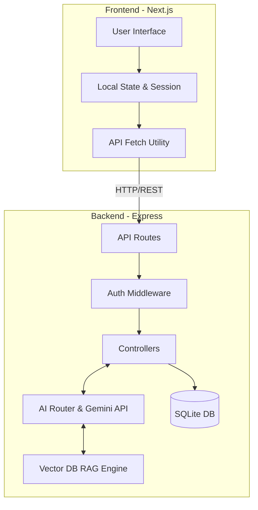

# System Design & Architecture

IWIS is built on a decoupled client-server architecture. The frontend is a Next.js (React) Single Page Application, while the backend is an Express Node.js REST API backed by a lightweight SQLite database.

## High-Level Architecture

## Core Modules

### 1. Authentication
IWIS uses stateless **JSON Web Tokens (JWT)**.
- **Login:** Users authenticate via email/password. The backend hashes passwords using `bcrypt`.
- **Session:** A JWT is returned and stored in `sessionStorage` (or `localStorage`).
- **Authorization:** `authLimiter` prevents brute-force. Role-Based Access Control (RBAC) enforces `role="citizen"` or `role="recycler"` on protected routes.

### 2. AI Scanner
The core of the citizen experience.
1. **Client-side Compression:** Images are compressed (WebP, max 1000px, 50-70% quality) natively in the browser via Canvas API.
2. **Payload:** Sent as a Base64 string to the backend to avoid complex multipart/form-data parsing for MVP.
3. **AI Routing:** The `ai-router.util.ts` attempts to hit the primary Gemini Pro Vision model. If it fails (quota or downtime), it cascades seamlessly to backup API keys.
4. **Classification:** Returns structured JSON containing Material Type, Confidence, and an Estimated Weight.

### 3. Scrap Price Engine
IWIS dynamically calculates earnings based on a localized pricing model.
- Prices are seeded per region (e.g., Jammu) in the `scrap_prices` table.
- When a citizen scans waste, the backend joins the AI-classified material against `scrap_prices` to return an *Estimated Value*.
- Final payout occurs when the recycler confirms the actual weight on the physical scale.

### 4. Recycler Flow (Geospatial Feed)
- Recyclers view a live feed of active waste listings.
- The backend calculates the Haversine distance between the recycler's GPS coordinates (if provided) and the listing's coordinates.
- **Concurrency:** A pessimistic lock equivalent (`status = 'active'`) prevents two recyclers from accepting the same listing simultaneously. Double-click prevention is heavily enforced on the frontend.

### 5. Earnings Engine
- **Citizen:** Accrues INR (₹) and "Green Points" for gamification (Tiers: Seed -> Sprout -> Tree).
- **Recycler:** The platform generates a transaction record upon pickup completion.
- Transactions are immutable ledgers linking the Recycler, the Citizen, and the Listing.

### 6. Notifications
- System-generated alerts are pushed to the `notifications` table during state changes (e.g., "Recycler scheduled a pickup", "Earned 500 points").
- The frontend polls these on load and displays them in a dedicated UI.

### 7. Database (SQLite)
We chose SQLite for the MVP to eliminate infrastructure overhead.
- Schema is auto-migrated via idempotent `ALTER TABLE` statements on boot (`db.ts`).
- Highly performant for read-heavy operations with sub-10k concurrent users.

### 8. Future Scaling
As IWIS expands beyond the Jammu pilot:
1. **Database:** Migrate from SQLite to PostgreSQL (Supabase/Neon) for horizontal scaling and PostGIS for advanced geospatial queries.
2. **Storage:** Move Base64 image storage to AWS S3 / Cloudinary to reduce database bloat.
3. **Real-time:** Replace HTTP polling with WebSockets (Socket.io) for live recycler tracking.
