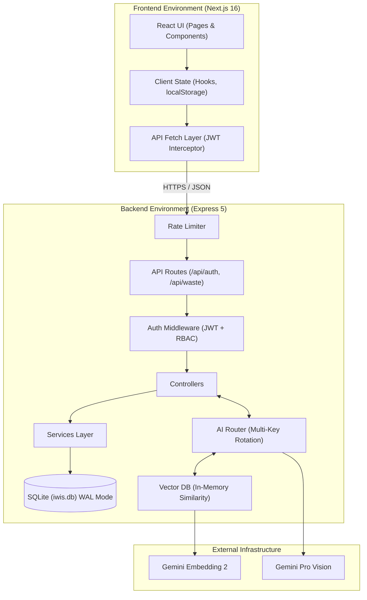

# Volume 1: Core Strategy & Architecture

## 1. Executive Summary

### WHAT
IWIS (India Waste Intelligence System) is an AI-powered, multi-sided marketplace and intelligence platform designed to completely digitize and optimize the waste management value chain. It directly connects citizens, waste aggregators (recyclers), and municipalities on a single interoperable data layer. 

### WHY
Traditional waste management systems in emerging economies operate blindly. Citizens lack the knowledge and incentive to segregate waste, municipalities struggle to optimize collection routes without real-time data, and recyclers face inconsistent supply chains. Valuable recyclable material ends up in landfills, creating severe environmental and public health hazards. The fundamental problem is **information asymmetry**. 

### HOW
IWIS resolves this asymmetry through a highly decoupled client-server architecture:
- **Frontend**: A Next.js 16 (App Router) Single Page Application delivering a mobile-first, native-like experience via Progressive Web App (PWA) principles.
- **Backend**: An Express 5 Node.js REST API providing high-throughput state management and orchestration.
- **AI Layer**: Deep integration with Google's Gemini Vision models for instant waste material classification, automated pricing estimations, and RAG-based sustainability assistance.

### LIMITATIONS
The current V1 architecture relies on a local SQLite database (in WAL mode). While highly performant for low-to-medium concurrency and rapid iteration, it introduces geographic coupling to the Node.js server instance and prevents true horizontal scaling of the backend fleet.

### FUTURE MIGRATION
The persistent storage layer is designed to be migrated to PostgreSQL (via Prisma or TypeORM) to support read-replicas, geospatial indexing (PostGIS), and multi-region high availability once the active user base exceeds local disk throughput limits.

---

## 2. Project Vision

The vision of IWIS is to **transform waste from an environmental liability into a liquid digital asset.** 

By making waste instantly recognizable (via AI), quantifiable (via CO₂ tracking), and tradable (via the marketplace), IWIS aims to shift the public perception of recycling from a civic duty to an economic opportunity. The ultimate goal is to process millions of transactions daily, providing governments with the macro-level intelligence needed to transition to a true circular economy.

---

## 3. Problem Statement

Before IWIS, the ecosystem suffered from four critical failures:
1. **Citizen Friction:** Segregation is confusing. Citizens do not know what is recyclable, how to dispose of it, or what it is worth.
2. **Aggregator Inefficiency:** Recyclers (Kabadiwalas) spend 60% of their operational time searching for high-quality, segregated material rather than processing it.
3. **Regulatory Blindness:** Municipalities cannot enforce Extended Producer Responsibility (EPR) mandates because the informal sector operates entirely off-ledger.
4. **Data Silos:** NGOs, animal shelters, and waste-to-energy plants have no unified mechanism to signal demand or discover supply.

IWIS is engineered specifically to eliminate these exact friction points using applied AI and decentralized marketplace mechanics.

---

## 4. Engineering Principles

Every line of code and architectural decision in IWIS is evaluated against four non-negotiable engineering principles:

### 4.1 Stateless and Decoupled
The backend MUST remain entirely stateless. We do not use server-side sessions. All authentication is handled via cryptographically signed JWTs. This ensures the frontend and backend can be scaled, deployed, and reverted entirely independently of one another. 

### 4.2 Graceful AI Degradation
AI is treated as a highly volatile external dependency. If Google's Gemini API rate-limits us, experiences downtime, or returns malformed JSON, the system MUST NOT crash. IWIS implements strict timeout races, multi-key rotation cascades, and hardcoded fallback heuristics to ensure the citizen can always complete their workflow.

### 4.3 Pessimistic Concurrency in Marketplaces
In a digital marketplace representing physical goods, race conditions are catastrophic (e.g., two recyclers accepting the same waste pickup simultaneously). The database schema and controller logic enforce strict pessimistic locking and atomic status updates to guarantee transactional integrity.

### 4.4 Mobile-First, Bandwidth-Conscious
The primary user base accesses IWIS via low-end Android devices on unstable 4G networks. Client-side images are aggressively compressed via the Canvas API *before* transmission, and the UI relies on highly optimized Tailwind CSS with minimal client-side JavaScript bundles to ensure sub-second Time-To-Interactive (TTI).

---

## 5. Architecture Overview

IWIS employs a decoupled Single Page Application (SPA) architecture communicating with a RESTful JSON API. 

### Internal Architecture



### Design Decisions & Trade-offs

| Decision | Why Chosen | Trade-off / Disadvantage |
| :--- | :--- | :--- |
| **Next.js SPA (Static Export)** | Maximizes edge delivery speed via Vercel. Eliminates SSR latency for highly interactive views. | SEO for protected routes is irrelevant, but initial bundle size must be carefully managed. |
| **Express 5.x** | Native Promise support eliminates the need for `express-async-handler`. Massive ecosystem. | Lacks the strict opinionated structure of NestJS, requiring strong team discipline. |
| **SQLite (WAL Mode)** | Zero operational overhead. Blazing fast for read-heavy workloads. Perfect for V1. | Locks the architecture to a single persistent disk. Cannot scale horizontally across multiple instances. |
| **JWT Authentication** | Completely stateless. Reduces DB lookups on every single authenticated request. | Token revocation is difficult. Requires short-lived tokens and careful frontend storage (localStorage vs httpOnly cookies). |

---

## 6. Repository Tour

To onboard quickly, engineers must understand the repository boundaries and ownership. The repository is structured as a monorepo containing two distinct, independently deployable environments.

### Complete Folder Index

```text
iwis/
├── frontend/                 # Next.js 16 Client Application
│   ├── app/                  # App Router: Pages, Layouts, and Routes
│   │   ├── dashboard/        # Citizen Dashboard
│   │   ├── marketplace/      # Citizen listing management
│   │   ├── recycler/         # Recycler-specific feeds and maps
│   │   ├── scan/             # AI Camera interface
│   │   └── chat/             # EcoBot RAG interface
│   ├── components/           # Reusable React components (UI library)
│   ├── lib/                  # Shared utilities (API clients, Firebase, utils)
│   └── public/               # Static assets (icons, manifest)
│
├── backend/                  # Express 5 REST API
│   ├── src/
│   │   ├── controllers/      # Request validation and HTTP response mapping
│   │   ├── middleware/       # Auth validation, RBAC, error handling, rate limits
│   │   ├── models/           # TypeScript interfaces and type definitions
│   │   ├── routes/           # Express router definitions
│   │   ├── services/         # Core business logic (AI, RAG, Hash)
│   │   ├── utils/            # Helpers (API Error, AI key rotation)
│   │   ├── db.ts             # SQLite connection and raw SQL schema
│   │   └── server.ts         # Express bootstrap and port binding
│   ├── knowledge/            # Markdown files used for RAG embeddings
│   ├── scripts/              # Database seeders (seed-demo.ts)
│   └── data/                 # SQLite database storage (gitignored)
│
├── docs/                     # Legacy/working documentation
└── assets/                   # Public repository assets (README images, walkthroughs)
```

### File Ownership Map
- **Frontend Architects:** Own `frontend/app/*` and `frontend/components/*`. Responsible for state management, hydration, and UI performance.
- **Backend Architects:** Own `backend/src/controllers/*` and `backend/src/services/*`. Responsible for data integrity, API latency, and AI routing logic.
- **DevOps/Infrastructure:** Own `render.yaml`, `.github/`, and deployment configuration.

---
*Volume 1 completed. Awaiting authorization to proceed to Volume 2: System Components.*
